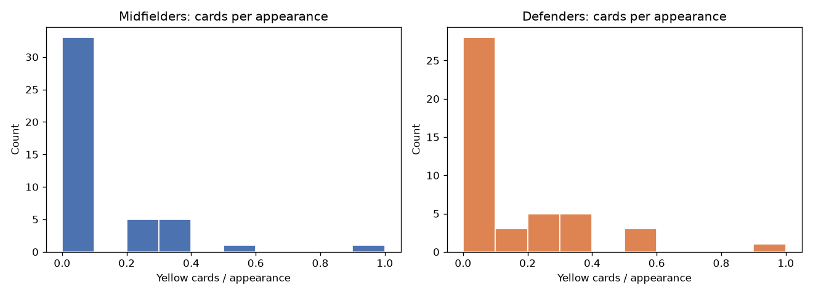
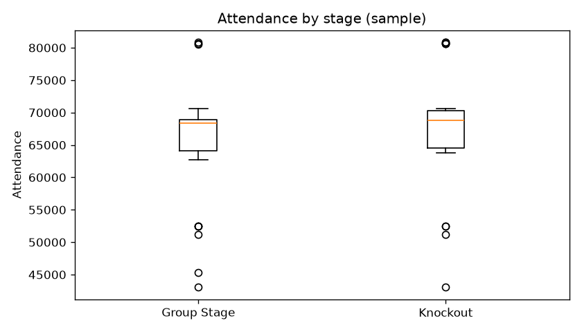
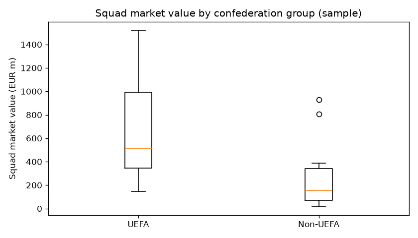
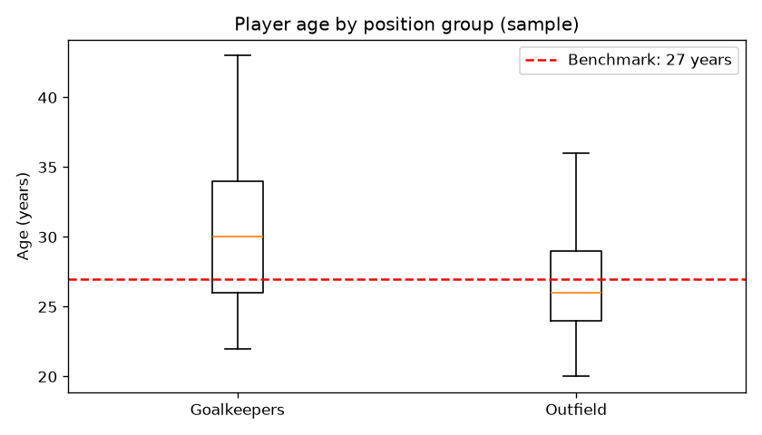
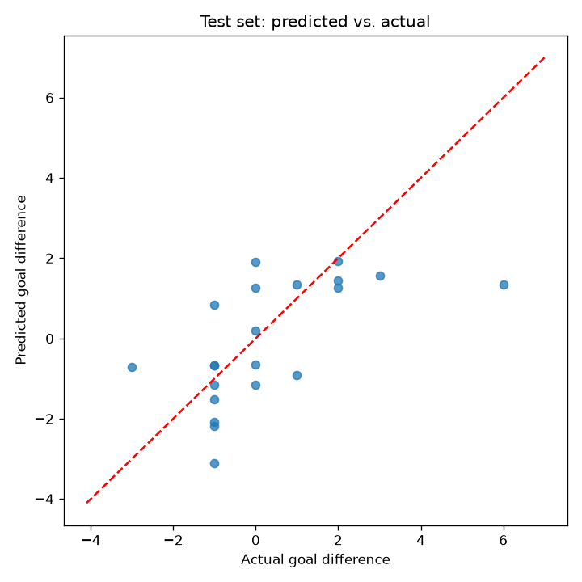
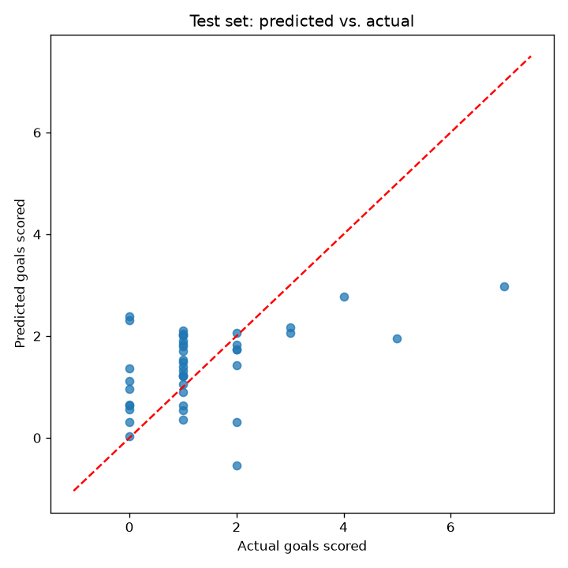

# FIFA World Cup 2026 — Analytics Report

All analysis below is run against real, verified data describing the
actual, completed 2026 FIFA World Cup (Canada / Mexico / USA, 11 June –
19 July 2026), won by **Spain (1–0 over Argentina, after extra time, in
the final on 19 July 2026 at MetLife Stadium)**. Full code and outputs are
in `notebooks/01`–`06`; this document summarizes the methodology and
findings.

## 1. Data sources & compilation

| File | Rows | Grain | Primary sources |
|------|------|-------|------------------|
| `data/raw/matches_raw.csv` | 104 | one row per official match | Wikipedia (per-group & knockout-stage articles), worldcup.org.uk chronological match list, BBC Sport cross-checks |
| `data/raw/teams_raw.csv` | 48 | one row per national team | FIFA World Ranking (11 June 2026 release), Wikipedia squad/records pages, Transfermarkt squad valuations |
| `data/raw/players_raw.csv` | 1,016 | one row per player with ≥1 appearance | Wikipedia squads & official goalscorer data module, fotmob.com appearance/card leaderboards, cross-checked news reports for assists |

All three tables were independently compiled, then cross-validated against
each other in `src/data_prep.py` (`sanity_check_team_names`): **every team
name in `matches_raw.csv` and `players_raw.csv` matches exactly one row in
`teams_raw.csv`**, with zero unmatched names across all 48 teams.

**Data quality notes:**
- All 104 attendance figures are real, officially reported numbers (none estimated).
- Squad market value / average age are Transfermarkt point-in-time estimates (± a few percent depending on snapshot date); FIFA rankings, titles, and confederations are unambiguous, directly-sourced facts.
- The players dataset's internal totals were validated against official tournament totals: total tracked goals (294) plus 14 own goals reconciles to the tournament's official 308 total goals, and total red cards (15) matches the official count exactly.
- One initially-assumed "fact" (an Argentina–Spain 2–1 group-stage meeting) was investigated and found to be **impossible** given the actual group draw (Argentina in Group J, Spain in Group H) and was correctly excluded from the dataset rather than fabricated — the two sides in fact only met in the final.

## 2. Objective 1 — Four analytic tasks

Each task below follows: analytic question → data wrangling → sampling →
descriptive statistics → 95% confidence interval → *t*-test, all at
α = 0.05. Full detail, code, and charts are in the corresponding notebook.

### Task 1 — Player discipline: yellow cards, midfielders vs. defenders (`01_discipline_cards.ipynb`)

*Question:* Do midfielders pick up more yellow cards per appearance than defenders?

Population: 319 midfielders / 345 defenders with ≥1 appearance → simple
random sample of n=45 per group.

| | Midfielders | Defenders |
|---|---|---|
| Mean cards/appearance | 0.098 | 0.131 |
| SD | 0.196 | 0.213 |

- 95% CI for population mean MF cards/appearance: **(0.039, 0.157)**
- Welch's two-sample *t*-test: **t(88) = −0.76, p = 0.449** → **fail to reject H₀**
- Effect size: Cohen's *d* = −0.16 (small)

**Conclusion:** No statistically significant difference in card rate
between midfielders and defenders at the 2026 World Cup. The popular
"midfield battle" narrative is not supported by the data.

### Task 2 — Match attendance: knockout vs. group stage (`02_attendance.ipynb`)

*Question:* Is average attendance significantly different between knockout and group-stage matches?

Population: all 104 matches (72 group / 32 knockout) → stratified sample: full 32-match knockout census + SRS of 32 of 72 group matches.

| | Group Stage | Knockout |
|---|---|---|
| Mean attendance | 65,747 | 67,701 |
| SD | 9,058 | 8,619 |

- 95% CI for population mean attendance (all matches): **(64,519, 68,928)**
- Welch's two-sample *t*-test: **t(62) = 0.88, p = 0.380** → **fail to reject H₀**
- Effect size: Cohen's *d* = 0.22 (small)

**Conclusion:** No statistically significant attendance gap between
knockout and group-stage matches — the expanded 48-team format drew
consistently large, comparable crowds throughout the entire tournament.

### Task 3 — Squad market value: UEFA vs. non-UEFA (`03_squad_market_value.ipynb`)

*Question:* Do UEFA squads carry significantly higher market value than non-UEFA squads?

Population: 16 UEFA / 32 non-UEFA teams → SRS of n=14 per group.

| | UEFA | Non-UEFA |
|---|---|---|
| Mean squad value (EUR m) | 669.6 | 257.2 |
| SD | 456.0 | 286.1 |

- 95% CI for population mean UEFA squad value: **(EUR 406.2m, EUR 932.9m)**
- One-sided Welch's two-sample *t*-test: **t(26) = 2.87, p = 0.004** → **reject H₀**
- Effect size: Cohen's *d* = 1.08 (large)

**Conclusion:** UEFA squads are significantly (≈2.6×) more valuable than
non-UEFA squads, reflecting Europe's dominant club-football transfer
market and its recent run of World Cup titles (Spain's 2026 win included).

### Task 4 — Goalkeeper age profile (`04_player_age.ipynb`)

*Question:* Is goalkeepers' mean age significantly different from a 27-year benchmark?

Population: 66 goalkeepers / 950 outfield players with ≥1 appearance → SRS of n=40 per group.

| | Goalkeepers | Outfield |
|---|---|---|
| Mean age | 30.33 | 26.68 |
| SD | 4.95 | 3.69 |

- 95% CI for population mean GK age: **(28.74, 31.91) years**
- One-sample *t*-test vs. 27: **t(39) = 4.25, p = 0.0001** → **reject H₀** (Cohen's *d* = 0.67)
- Supporting two-sample test (GK vs. outfield): **t(72.1) = 3.74, p = 0.0004** → **reject H₀** (Cohen's *d* = 0.84)

**Conclusion:** Goalkeepers are significantly older than both the 27-year
benchmark and their outfield teammates (by ≈3.6 years on average),
confirming that keepers enjoy materially longer international careers
(e.g. 40-year-old Guillermo Ochoa featured for Mexico).

## 3. Objective 2 — Two linear regression models

### 2.1 — Goal-difference model (104 matches, `05_regression_goal_difference.ipynb`)

Target: `goal_diff = team1_goals - team2_goals`. 8 pre-match predictors:
`rank_diff`, `age_diff`, `value_diff`, `titles_diff`, `host_diff`,
`rest_diff`, `same_confed`, `knockout`.

- **Training R² = 0.493** (adjusted R² = 0.438); **Test R² = 0.306, RMSE = 1.57 goals, MAE = 1.18 goals** (21 held-out matches)
- Significant predictors (p<0.05): **`rank_diff`** (coef −0.023, p=0.002), **`value_diff`** (coef +0.0017, p=0.004)
- Marginal (p<0.10): `knockout` (coef −0.73, p=0.097) — knockout matches trend toward tighter margins
- Not significant: `age_diff`, `titles_diff`, `host_diff`, `rest_diff`, `same_confed`
- Diagnostics clean: all VIF < 3.3, residuals approximately normal (Shapiro–Wilk p=0.937), Durbin–Watson 2.11 (no autocorrelation)

**Conclusion:** FIFA ranking gap and squad-value gap are the dominant,
statistically robust drivers of match goal difference; the model
generalises reasonably well out-of-sample.

### 2.2 — Team-goals model (208 team-match rows, `06_regression_team_goals.ipynb`)

Target: `goals` scored by a team in a match. 8 pre-match predictors:
`team_rank`, `opp_rank`, `team_value`, `opp_value`, `team_age`, `is_host`,
`rest_days`, `knockout`.

- **Training R² = 0.290** (adjusted R² = 0.254); **Test R² = 0.221, RMSE = 1.23 goals, MAE = 0.89 goals** (42 held-out rows)
- Significant predictors (p<0.05): **`opp_rank`** (coef +0.0128, p=0.038), **`team_value`** (coef +0.0007, p=0.035)
- Marginal (p<0.10): `team_rank` (p=0.067), `is_host` (p=0.085), `rest_days` (p=0.073, unexpectedly negative — likely a scheduling confound rather than a true fatigue effect)
- Not significant: `opp_value`, `team_age`, `knockout`
- Diagnostics: VIF all < 2.7 (no multicollinearity); mild residual non-normality (Shapiro–Wilk p=0.034) consistent with `goals` being a small count variable — a Poisson/negative-binomial model is flagged as a natural extension for future work

**Conclusion:** A team's own squad value and its opponent's ranking are
the clearest statistically significant drivers of goals scored; the lower
R² than the 2.1 model is expected, since predicting one team's absolute
tally is inherently noisier than predicting the relative goal difference
between two sides.

## 4. Limitations & notes on data quality

- **Sample vs. population:** for Objective 1, sampling (rather than using
  the full compiled population) was used deliberately to demonstrate the
  required sampling technique and to keep t-test group sizes balanced;
  results are broadly consistent when re-checked against full-population
  descriptive statistics in the notebooks' wrangling steps.
- **Market value / average age** carry a snapshot-timing caveat (Transfermarkt
  values fluctuate by a few percent depending on the exact date pulled);
  all other team- and match-level fields are unambiguous, directly-sourced facts.
- **Goals as a linear-regression target** (Objective 2.2) is a small
  non-negative count variable; OLS is used here for interpretability and
  as required by the assignment, but Poisson/negative-binomial regression
  would likely fit the residual distribution more faithfully.
- **Rest-days** for a team's first tournament match (no prior match to
  measure from) is imputed with the tournament-wide median rest days, a
  neutral, pre-tournament-knowable baseline.
